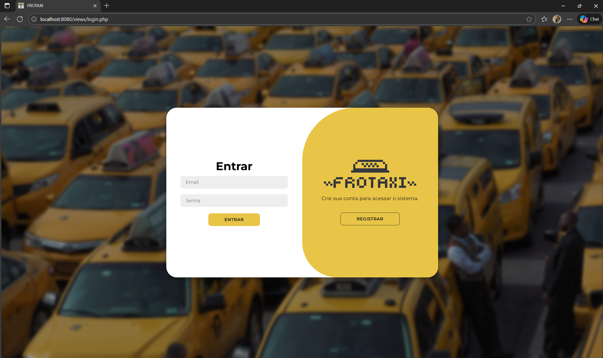
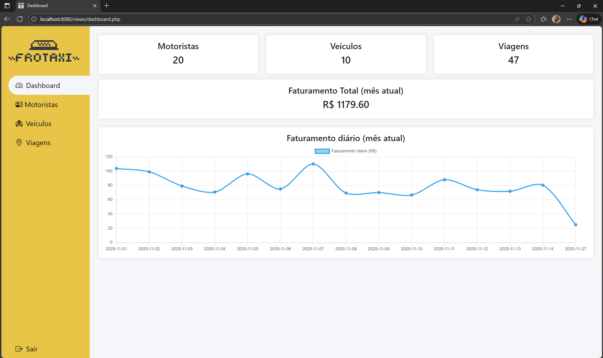
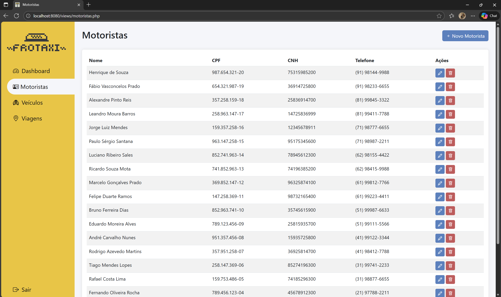
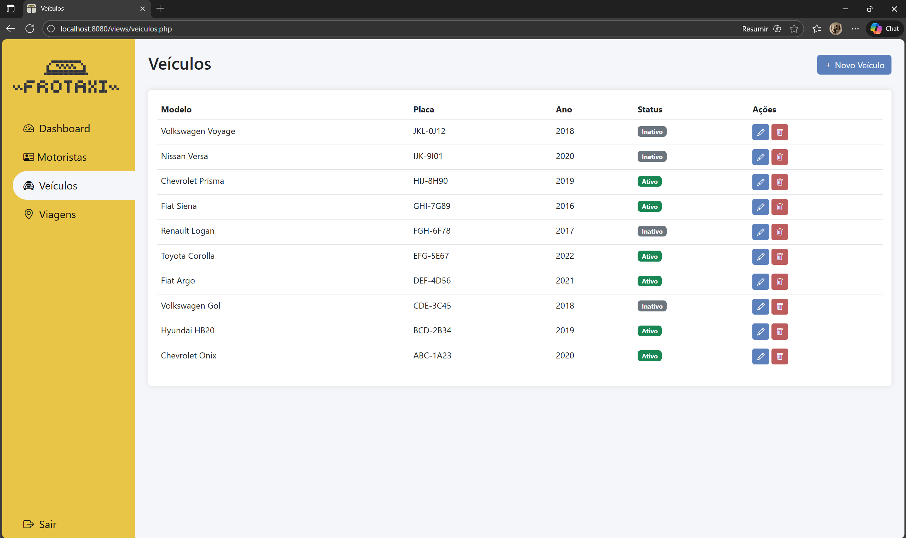
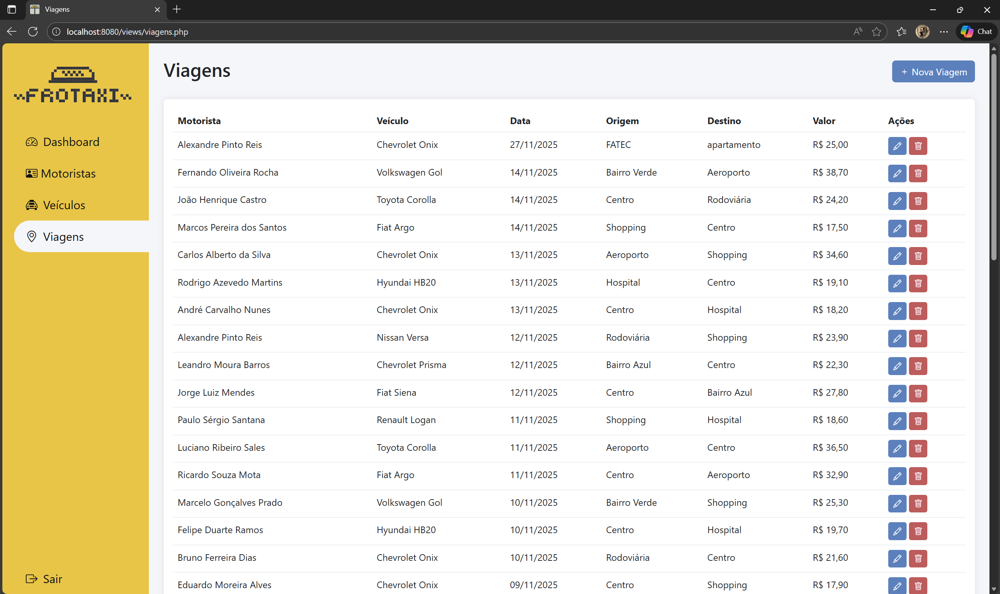

# 🚕 Sistema de Gestão de Frota de Táxi  
Sistema desenvolvido para fins acadêmicos, utilizando **PHP**, **MySQL**, **Bootstrap** e arquitetura **MVC simplificada**.  
O projeto permite gerenciar motoristas, veículos e viagens, além de exibir métricas e gráficos no dashboard.

---

## Demonstração em Vídeo
Assista ao vídeo completo explicando o sistema, seu funcionamento e a estrutura do código:

🔗 **Link para o vídeo:** [Clique aqui para assistir](https://youtu.be/SGrnCfzDIQA)

---

## Telas

| Tela | Imagem |
|------|--------|
| **Login** |  |
| **Dashboard** |  |
| **Lista de Motoristas** |  |
| **Lista de Veículos** |  |
| **Lista de Viagens** |  |

---
